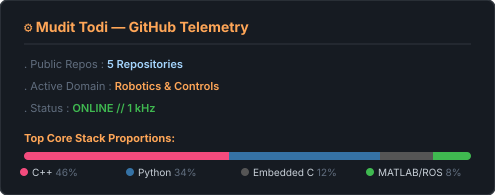

<div align="center">

<!-- GitAscii Dual-Theme Terminal Banner (Automatic Dark/Light Mode Switch) -->
<a href="https://7mudit14-svg.github.io/" target="_blank" rel="noopener noreferrer">
  <picture>
    <source media="(prefers-color-scheme: dark)" srcset="./gitascii.svg" />
    <source media="(prefers-color-scheme: light)" srcset="./gitascii-light.svg" />
    
  </picture>
</a>

<br/><br/>

<!-- Quick Navigation & Connect Badges -->
[](https://7mudit14-svg.github.io/)
[](https://www.linkedin.com/in/mudit-todi-b401ab347/)
[](https://drive.google.com/file/d/1ncxEG7yzrT4qCjeqFtR3ZxYZUUZ0gB6q/view?usp=sharing)
[](https://github.com/7mudit14-svg)
[](mailto:7mudit14@gmail.com)

</div>

---

### 📟 `$ whoami`

```bash
mudit@lnmiit:~$ whoami --verbose
>> Mudit Todi — Robotics & Adaptive Control Systems Engineer
>> Undergrad @ The LNM Institute of Information Technology (LNMIIT), Jaipur
>> Focus : Bridging nonlinear control theory (MRAC / IMC) with real-time embedded hardware (1 kHz C++ / ROS 2)
>> Status: Actively seeking Engineering Roles & Research Collaborations (2026)
>> Motto : "Don't just make it move. Understand why it moves. Model it. Control it. Measure it."
```

---

### 🎯 Work Areas

<table>
  <tr>
    <td width="33%" align="center">
      <h3>🤖 Robotics</h3>
      <p><b>ROS 2 Jazzy · MoveIt 2 · Gazebo Harmonic</b><br/>Cartesian trajectory planning, kinematics, URDF/Xacro modeling, and PX4/ArduPilot UAV stacks.</p>
    </td>
    <td width="33%" align="center">
      <h3>⚡ Embedded Systems</h3>
      <p><b>1 kHz C++ · STM32 · ESP32 · FreeRTOS</b><br/>Deterministic real-time firmware, embedded edge vision, and dual-layer production PCB design (EasyEDA/KiCad DFM).</p>
    </td>
    <td width="33%" align="center">
      <h3>🎛️ Control Systems</h3>
      <p><b>Direct MRAC · IMC · Lyapunov Stability</b><br/>Nonlinear adaptive control, σ-modification leakage, disturbance rejection, and MuJoCo 3.x dynamics validation.</p>
    </td>
  </tr>
</table>

---

### 🛠️ Skills & Tech Stack

```text
  [ Languages ]          C++ (1 kHz Real-Time) · Python · MATLAB / Simulink · Embedded C · Bash
  [ Robotics & Sim ]     ROS 2 (Jazzy) · MoveIt 2 · Gazebo Harmonic · MuJoCo 3.x · ArduPilot / PX4
  [ Control Theory ]     Direct MRAC · Robust MRAC (σ-mod) · Internal Model Control (IMC) · Lyapunov Stability
  [ Embedded & EDA ]     STM32 · ESP32 / ESP32-CAM · Raspberry Pi 5 · KiCad · EasyEDA · JLCPCB DFM
  [ Perception & Edge ]  OpenCV · YOLOv8 · Optical Flow Odometry · PCA Bounding Box · I²S / I²C / SPI
```

---

### 📌 Pinned Repositories

| Repository | Focus & Highlights | Stack |
| :--- | :--- | :--- |
| 🦾 **[`4dof_robotic_arm_mrac_controller_ROS2`](https://github.com/7mudit14-svg/4dof_robotic_arm_mrac_controller_ROS2)** | Robust Direct MRAC controller for 4-DOF manipulator without computing complex dynamics. Online gain adaptation + 6-term basis canceling Coriolis/friction. | `ROS 2 Jazzy` `C++ (1 kHz)` `MoveIt 2` `Gazebo` |
| 🕹️ **[`Cartpole_IMC_MRAC`](https://github.com/7mudit14-svg/Cartpole_IMC_MRAC)** | MuJoCo simulation & benchmarking suite: Cascaded IMC-PID vs. Direct MRAC vs. Robust MRAC. Demonstrates **-43.7% ISE reduction** under velocity impulses. | `Python` `MuJoCo 3.x` `Lagrangian Mechanics` |
| 🛰️ **[`IMC-2025`](https://github.com/7mudit14-svg/IMC-2025)** | GPS-Denied Surveillance UAV demonstrated at **India Mobile Congress 2025**. RF-jamming immune directional optical/IR link (52 kbps @ 20 ft) + YOLOv8 edge detection. | `Python` `ArduPilot` `Raspberry Pi 5` `Optical Flow` |

---

### 📊 GitHub Telemetry

<div align="center">

<!-- Dual Telemetry: Self-Hosted Andrew6rant Card (Left) + Live Streak Telemetry (Right) -->
<picture>
  <source media="(prefers-color-scheme: dark)" srcset="./github-stats.svg" />
  <source media="(prefers-color-scheme: light)" srcset="./github-stats-light.svg" />
  
</picture>


<br/>

<sub>Engineered with <a href="https://gitascii.com/"><b>GitAscii</b></a> terminal styling · © <a href="https://7mudit14-svg.github.io/">Mudit Todi</a></sub>

</div>
